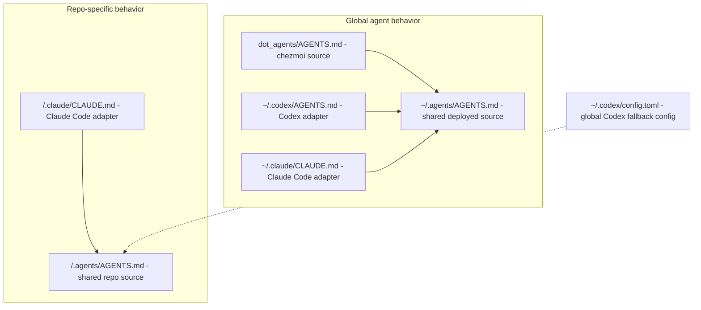
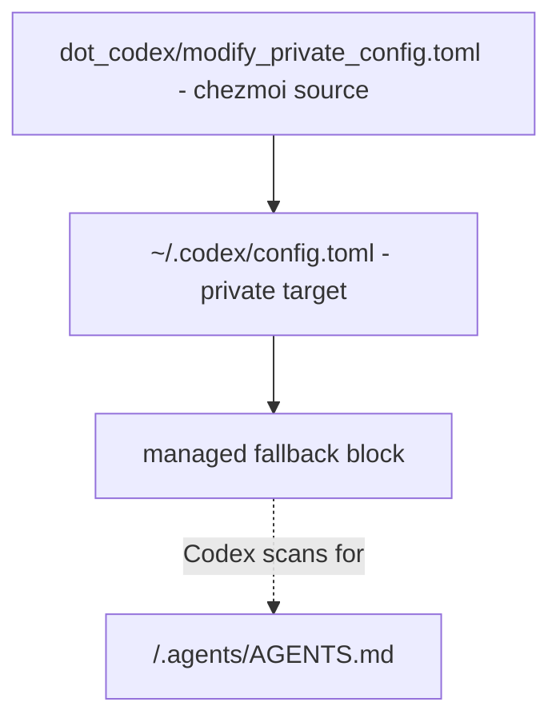
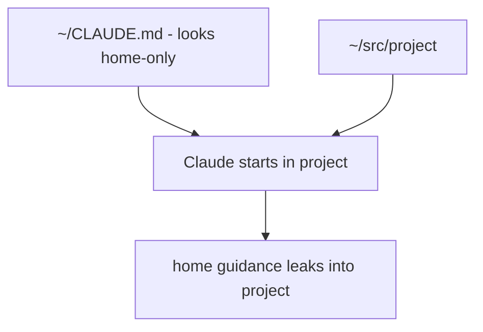

# Codex and Claude Instructions — Cheat Sheet

You want one shared instruction core that Codex and Claude Code can use, without
scattering duplicated prompts across tool-specific folders. Keep the real
instructions in `.agents/AGENTS.md`, then expose that file through the
entrypoints each tool actually reads.

This setup also fixes the home-directory trap: `~/CLAUDE.md` looks like a home-only note, but Claude Code can inherit it into every project under `$HOME`.

> **Claude means Claude Code here.** Claude Cowork has a stricter boundary for
> user-level symlinks, covered below. The current global adapter is skipped
> when its target lies outside the Cowork session's working directory.

---

## The model

The real content lives in `.agents`. Tool-specific files are adapters, not sources of truth.



Use this split:

| Layer | Source of truth | Tool entrypoint |
|---|---|---|
| Global | `~/.agents/AGENTS.md` | Codex and Claude Code adapters |
| Repo-specific | `<repo>/.agents/AGENTS.md` | Claude Code adapter plus Codex fallback discovery |

> **Key distinction.** `.agents/AGENTS.md` is Flo's convention. Claude Code and Codex do not both discover every `.agents` path natively. The adapters and Codex fallback make the convention real.

---

## Global instructions

Global instructions are the defaults every agent should remember: output style, debugging posture, routine checks, shell quirks, skill ownership, and personal preferences.

The source is deployed by chezmoi:

```text
dot_agents/AGENTS.md
→ ~/.agents/AGENTS.md
```

The tool entrypoints are symlinks:

```text
~/.codex/AGENTS.md  -> ~/.agents/AGENTS.md
~/.claude/CLAUDE.md -> ~/.agents/AGENTS.md
```

In chezmoi source, those symlinks are templates:

```text
dot_codex/symlink_AGENTS.md.tmpl
dot_claude/symlink_CLAUDE.md.tmpl
```

Each template contains the same target:

```gotemplate
{{ .chezmoi.homeDir }}/.agents/AGENTS.md
```

> **Why symlinks, not copies?** Copies drift. Symlinks make the tool-specific files boring adapters, so editing `~/.agents/AGENTS.md` updates both tools.

> **Cowork exception.** Claude Cowork desktop sessions skip a symlinked
> `~/.claude/CLAUDE.md` when it points outside the session's working directory.
> The current adapter therefore is not reliable for Cowork sessions rooted
> below `$HOME`. If Cowork needs the same global guidance, deploy a regular
> generated `~/.claude/CLAUDE.md` from the shared chezmoi source instead of
> hand-maintaining a copy.

---

## Repo instructions

Repo instructions should only apply inside that repo. In this dotfiles repo, the shared source is:

```text
.agents/AGENTS.md
```

Claude Code gets an adapter:

```text
.claude/CLAUDE.md -> ../.agents/AGENTS.md
```

Codex gets discovery through the global fallback:

```toml
project_doc_fallback_filenames = [".agents/AGENTS.md"]
```

That lets Codex find `<repo>/.agents/AGENTS.md` without needing every repo to duplicate instructions into a Codex-specific file.

> **Yes, fallback really means fallback.** This is a fallback *filename*, not a
> second instruction layer. In each directory, Codex loads the first non-empty
> match: `AGENTS.override.md`, then `AGENTS.md`, then the configured fallback
> names. It never combines a native root file with the root
> `.agents/AGENTS.md`. If a native file exists, the fallback loses.

> **About `.codex/AGENTS.md`.** Codex does not scan
> `<repo>/.codex/AGENTS.md` when it starts from the repo root. This repo's
> symlink is documentation only, not a working adapter. Keeping it is harmless
> only if that limitation is explicit; removing it would be less misleading.

### Keep the shared core lean

Both tools pay for these files in their startup context:

- Claude Code recommends keeping each `CLAUDE.md` under roughly 200 lines.
- Codex stops adding discovered instruction files at 32 KiB combined by
  default (`project_doc_max_bytes`).

Check the shared global and repo sources together:

```bash
wc -l ~/.agents/AGENTS.md .agents/AGENTS.md
wc -c ~/.agents/AGENTS.md .agents/AGENTS.md
```

Keep durable cross-tool rules here. Move repeatable procedures to skills and
use nested instructions only when a subtree genuinely needs different rules.

---

## Codex fallback config

The problem: `~/.codex/config.toml` is private and machine-specific, but a few
public-safe settings belong in chezmoi.

Do not manage the whole file. It contains project paths, hook trust hashes, and
other local state. Instead, chezmoi owns marked blocks and preserves the
unmanaged TOML, comments, and table order.



The source file is:

```text
dot_codex/modify_private_config.toml
```

The naming matters:

| Part | Meaning |
|---|---|
| `dot_codex` | target lives under `~/.codex` |
| `modify_` | transform the existing target instead of replacing it |
| `private_` | keep target mode private, `0600` |
| `config.toml` | target filename |

> **Naming gotcha.** The canonical combined name is `modify_private_config.toml`, not `private_modify_config.toml`. The latter maps to the wrong target path.

> **Private stays private.** The `private_` attribute makes chezmoi keep the
> target at mode `0600`. No separate `chmod` step is part of the workflow.

The fallback block is intentionally small:

```toml
# chezmoi-managed:start codex-agents-fallback
project_doc_fallback_filenames = [".agents/AGENTS.md"]
# chezmoi-managed:end
```

How it works:

1. Chezmoi reads the current `~/.codex/config.toml`.
2. The current contents become `.chezmoi.stdin`.
3. The template writes its managed blocks first.
4. It removes old copies of those blocks from stdin.
5. It writes the unmanaged config back in its original order.

The current template manages two blocks: instruction fallback and Codex shell
execution. This section focuses on the fallback, but both are removed and
reinserted on each render.

> **Why not `setValueAtPath`?** Chezmoi can parse TOML and set a value structurally, but that reserializes the whole file. For Codex config, that risks changing comments, table order, and Codex-managed local state. A marked block is cruder, but it preserves the private file almost exactly.

> **Why not `run_onchange_`?** A run script hides a file mutation inside imperative shell code. `modify_` is chezmoi's native partial-file primitive, and `chezmoi diff` can show the resulting target change.

---

## Home directory behavior

The home directory needs special handling, but `~/CLAUDE.md` is the wrong place for it.

Claude Code walks parent directories looking for instruction files. A file at
`~/CLAUDE.md` can become inherited context for projects under `$HOME`, which
means a "home-only" note leaks into unrelated repos.



The fix is:

```text
remove_CLAUDE.md
→ removes ~/CLAUDE.md
```

Home-specific behavior moves into the global `~/.agents/AGENTS.md` as a conditional rule:

```md
When the current working directory is exactly `$HOME`, treat it as a personal admin shell, not a project repository.
```

That rule is global, but it only activates in one directory.

> **Rejected approach.** A shell wrapper could inject home-only instructions, but then agent behavior becomes hidden in shell startup. One conditional sentence in the shared instructions is easier to see and debug.

---

## Chezmoi source vs target

The most common mistake is confusing source-only repo paths with deployed home paths.

Literal dot directories in the repo are for this repo. `dot_` directories deploy into `$HOME`.

| Chezmoi source | Target | Role |
|---|---|---|
| `dot_agents/AGENTS.md` | `~/.agents/AGENTS.md` | Global shared instruction source |
| `dot_codex/symlink_AGENTS.md.tmpl` | `~/.codex/AGENTS.md` | Codex global adapter |
| `dot_claude/symlink_CLAUDE.md.tmpl` | `~/.claude/CLAUDE.md` | Claude Code global adapter; Cowork may skip it |
| `dot_codex/modify_private_config.toml` | `~/.codex/config.toml` | Private partial Codex config |
| `.agents/AGENTS.md` | not deployed | This repo's instruction source |
| `.claude/CLAUDE.md` | not deployed | This repo's Claude Code adapter |
| `.codex/AGENTS.md` | not deployed | Documentation only; not normal repo discovery |
| `remove_CLAUDE.md` | removes `~/CLAUDE.md` | Prevents Claude Code ancestor leakage |

> **Rule of thumb.** If the source path starts with a literal dot directory, it affects this repo. If it starts with `dot_`, it deploys into home.

---

## Apply and verify

Use narrow applies when changing instruction plumbing. It keeps unrelated
managed files and run scripts out of the debugging loop.

```bash
chezmoi diff -- ~/.agents/AGENTS.md ~/.codex/AGENTS.md ~/.claude/CLAUDE.md ~/.codex/config.toml ~/CLAUDE.md
chezmoi --no-tty apply -- ~/.agents/AGENTS.md ~/.codex/AGENTS.md ~/.claude/CLAUDE.md ~/.codex/config.toml ~/CLAUDE.md
chezmoi --no-tty verify -- ~/.agents/AGENTS.md ~/.codex/AGENTS.md ~/.claude/CLAUDE.md ~/.codex/config.toml ~/CLAUDE.md
```

`chezmoi verify` exits `0` with no output when those targets match. Prefer it to
a broad `chezmoi status`, which can report unrelated pending scripts or drift.

The expected Codex config diff is tiny:

```diff
+# chezmoi-managed:start codex-agents-fallback
+project_doc_fallback_filenames = [".agents/AGENTS.md"]
+# chezmoi-managed:end
```

File verification proves the deployed state, not the context of an already
running agent. Codex builds its instruction chain once per run; Claude Code
loads memory files at session start.

```bash
codex --ask-for-approval never "List the instruction sources you loaded."
# In a new Claude Code session: run /context and inspect Memory files
```

> **Backup habit.** Before modifying private app config, make a timestamped copy with `cp -p`. The `-p` matters because it preserves mode `0600`.

---

## Official references

- [Codex custom instructions with `AGENTS.md`](https://developers.openai.com/codex/guides/agents-md)
- [Claude Code memory and `CLAUDE.md`](https://code.claude.com/docs/en/memory)

---

## Quick reference

| I want to... | Use |
|---|---|
| Edit global agent behavior | `~/.agents/AGENTS.md` |
| Deploy global behavior from chezmoi | `dot_agents/AGENTS.md` |
| Give Codex global instructions | `~/.codex/AGENTS.md -> ~/.agents/AGENTS.md` |
| Give Claude Code global instructions | `~/.claude/CLAUDE.md -> ~/.agents/AGENTS.md` |
| Give Cowork global instructions | regular generated `~/.claude/CLAUDE.md`, not the current symlink |
| Add repo-specific shared instructions | `<repo>/.agents/AGENTS.md` |
| Add Claude repo discovery | `<repo>/.claude/CLAUDE.md -> ../.agents/AGENTS.md` |
| Add Codex repo fallback | `project_doc_fallback_filenames = [".agents/AGENTS.md"]` |
| Avoid masking the Codex fallback | omit native files, or point them to the same shared source |
| Manage safe Codex config blocks | `dot_codex/modify_private_config.toml` |
| Remove home-root Claude Code leakage | `remove_CLAUDE.md` |
| Document home-only behavior | conditional rule in `~/.agents/AGENTS.md` |
| Check instruction size | `wc -l` for Claude Code, `wc -c` for Codex |
| Verify active Codex instructions | start a new run and list loaded sources |
| Verify active Claude Code instructions | start a new session and run `/context` |
