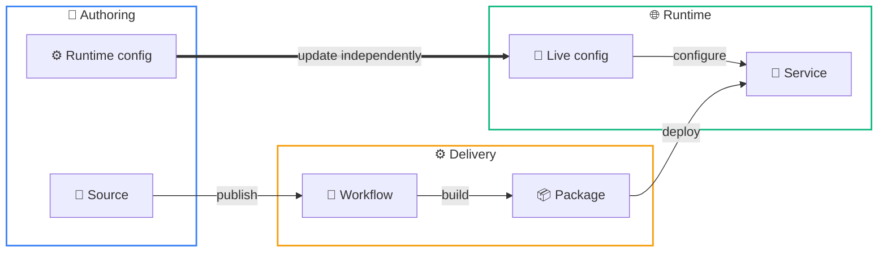
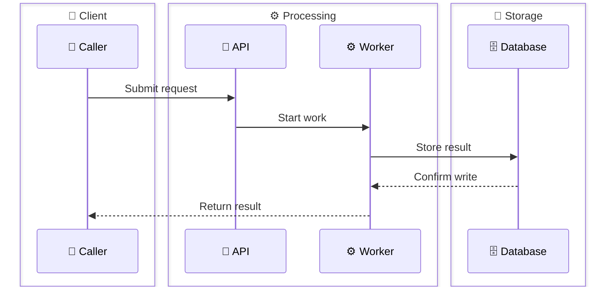

# Technical Diagram Style

Use this reference for Mermaid diagrams that explain systems, pipelines, agents, ownership, environments, or data movement.

## Choose by relationship

- **Sequence diagram**
  - Chronological interactions
  - Handoffs
  - Data movement over time
- **Left-to-right flowchart**
  - Systems
  - Ownership
  - Environments
  - Dependencies
  - Topology
- Change direction only when horizontal width or the relationship itself makes another layout clearer.
- A long linear flowchart is usually a sequence diagram in disguise.

## Make the relationship visible

- Group elements by meaningful system, responsibility, environment, or ownership boundaries.
- Use semantic emoji in group labels and important nodes or participants.
- Keep fills transparent or controlled by Mermaid's active theme.
- Use distinct, restrained border colours to improve scanning.
- Keep equivalent groups visually consistent within the same document.
- Simplify or remove groups when they obscure the main relationship.

## Put meaning in the right place

- **Nodes** represent:
  - Actors
  - Components
  - Data
  - Durable states
- **Arrows** represent:
  - Actions
  - Transfers
  - Handoffs
- Prefer an arrow label over an action-only node when no durable component exists.
- Labels carry the meaning; colour and emoji reinforce it.

## Sequence-diagram boundaries

Mermaid's sequence `box` colour controls the fill, not an independently configurable border.

- Give each group a unique, fully transparent `rgba(...,0)` value.
- Match that exact fill value with diagram-local `themeCSS`.
- Apply the saturated version of the colour to the boundary.
- Keep the alpha at `0`; fixed fills undermine theme-safe rendering.
- If a renderer stops supporting the selector:
  - Keep the boxes transparent and accept the renderer's neutral boundary.
  - Report the limitation.
  - Do not fall back to fixed fills.

## Teaching examples

### Copy these invariants

- Relationship-driven diagram choice
- Meaningful boundaries
- Transparent fills
- Restrained border colours
- Semantic emoji
- Actions on arrows
- Overall reading direction without forcing one linear path

### Adapt these details

- Group names
- Participant count
- Colours
- Emoji choices
- Direction and layout

The colours below demonstrate the mechanism. They are not a prescribed palette.

### Grouped flowchart

The map reads left to right, but configuration bypasses the delivery path and updates the runtime independently.

### Grouped sequence diagram

## Render only for structural uncertainty

- **Simple diagram**
  - Review the Mermaid source against the communication goal.
  - If the intended relationship, grouping, and direction are clear, no render is needed.
- **Complex diagram**
  - Render only when Mermaid's automatic layout may change or obscure the intended reading.
  - Complexity signals:
    - Multiple branches or handoffs
    - Nested or competing groups
    - Likely crossing edges
    - Long labels or unusual width
    - Mermaid-controlled ordering that may alter the reading path
- **If rendered, inspect structure only**
  - Reading direction
  - Grouping
  - Edge crossings
  - Node order
  - Label wrapping
- Do not switch themes or assess cosmetic appearance.
- Successful parsing validates syntax; it does not create a visual-QA requirement.
