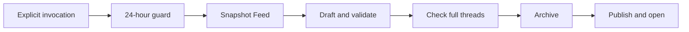

# Generate Newsletter Brief

Run this workflow only after an explicit `$generate-newsletter-brief`
invocation in the current user message.

## Fixed environment

- Vault: `/Users/flo/Work/Private/PKM/Obsidian/TheVault`
- Brief folder: `Newsletters/Briefs`
- Fastmail label: exact path `Feed`
- Time zone: `Europe/London`
- Format contract: `references/brief-format.md`
- Validator: `scripts/validate_brief.py`

Never commit or push as part of this workflow.

## 1. Enforce the invocation and time gates

Confirm that the current user message contains an explicit
`$generate-newsletter-brief` invocation. Stop otherwise.

Before calling any Fastmail tool, run:

`python3 ~/.agents/skills/generate-newsletter-brief/scripts/validate_brief.py guard --brief-dir "/Users/flo/Work/Private/PKM/Obsidian/TheVault/Newsletters/Briefs"`

Interpret the JSON result literally:

- `ok`: continue with its `checkpoint` value.
- `too_soon`: stop without contacting Fastmail. Report `latest_created` and
  `next_eligible`.
- `no_checkpoint`: stop and ask Flo for the first batch boundary.
- `invalid`: stop and report the invalid brief paths. Never fall back to an
  older checkpoint.

The guard uses 24 elapsed hours from the newest valid `created` timestamp.
There is no override.

## 2. Freeze the batch

Search Fastmail using `in:Feed` and a date one day earlier than the checkpoint's
London calendar date. Page until `hasMore` is false, then filter locally using
the exact rule `receivedAt > checkpoint`.

- Ignore `isRead`.
- Ignore Inbox membership.
- Sort the eligible messages by `receivedAt`, then freeze their IDs.
- Stop without changes when the frozen batch is empty.
- Require `id`, `threadId`, `messageId`, `subject`, `from`, and `receivedAt` for
  every message.
- Read every frozen message with `read_email`; summaries and previews are not
  sufficient.

Create a temporary JSON manifest containing those six source fields. Do not
write the manifest into the vault or the skill.

## 3. Draft the brief

Read `references/brief-format.md` completely, including its accepted editorial
calibration example, before drafting. Read every frozen email, then atomise
before synthesising:

- Build a compact editorial map in the private temporary directory before
  writing prose. Record each candidate atomic idea, its supporting source IDs,
  the exact shared claim, and one treatment:
  - Dedicated H2
  - Supporting detail
  - Compact roundup
  - `Everything Else`
- Select atomic ideas before choosing broad H1 shelves.
- Merge sources only when they support the same precise claim. A shared domain,
  mood, or moral is not sufficient.

- Prioritise the strongest ideas in the main brief. Complete reading and source
  coverage do not require equal narrative treatment.
- Preserve concrete mechanisms, models, numbers, and surprising details.
- Give genuinely distinct ideas separate sections.
- Do not force unrelated sources beneath one master thesis.
- Group weak, repetitive, and incidental sources compactly under
  `Everything Else`.

- Convert source and generation timestamps to `Europe/London`.
- Derive `brief from` and `brief until` from the earliest and latest frozen
  messages.
- Set `brief emails` to the frozen message count.
- Generate a concise descriptive filename from two or three dominant themes.
- Resolve the final destination before archiving.
- If the descriptive filename already exists, append ` (YYYY-MM-DD)`.
- Never overwrite a note.

Write the draft and manifest into a private temporary directory. Every source
must have one numbered footnote definition and at least one reference. Weave
useful sources into the relevant claims and gather the remainder under
`Everything Else`.

Before validation, compare the complete draft with the accepted example.
If independent ideas have been flattened beneath umbrella sections, discard the
draft outline and rebuild it once from the editorial map. Do not merely expand
the existing prose. Match the example's editorial quality, not its exact length,
section count, themes, or wording.

## 4. Validate before Fastmail changes

Run:

`python3 ~/.agents/skills/generate-newsletter-brief/scripts/validate_brief.py validate --note <draft-path> --manifest <manifest-path>`

Stop on any validation error. Do not archive or publish a partial brief.

Treat a successful result's `warnings` as non-blocking editorial diagnostics:

- When warnings appear, re-outline once from the editorial map and validate
  again.
- Do not block archiving or publication when reviewed warnings remain.
- Retain any remaining warnings for the final report.

## 5. Re-check and archive complete threads

Immediately before archiving, call `read_thread` once for every distinct frozen
`threadId`.

Abort before any mutation when:

- Any thread message lacks the exact `Feed` label.
- Any thread contains a protected non-Feed keeper.
- Any message received after the checkpoint is absent from the frozen snapshot.
- A required message or thread identifier changed or disappeared.

Earlier Feed-only history in the same thread is safe. Collect every message ID
from every checked thread, deduplicate them, and call `archive_email` once.
Require confirmed success before publishing.

Archiving removes Inbox while preserving the Feed label. If archiving fails or
is partial, do not publish. A later invocation can safely select the same batch
again because the checkpoint has not advanced.

## 6. Publish and open

Reconfirm that the destination does not exist, then publish the exact validated
draft into `Newsletters/Briefs`.

- Validate the published file again against the same manifest.
- Open it with Obsidian CLI.
- If opening fails, retain the valid note and report its absolute path.
- Report any remaining editorial warnings.
- Remove temporary files after success.

A run advances the 24-hour guard only when a valid brief exists in the vault.
If publishing fails after archiving, report the failure. The preserved Feed
label makes the batch recoverable on the next explicit invocation.
