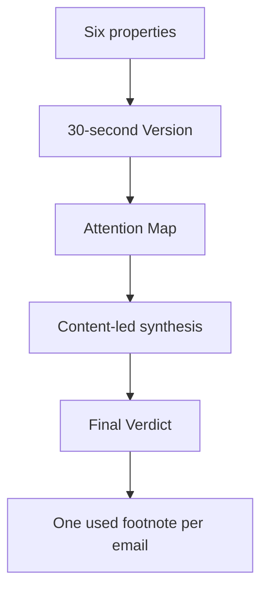

# Newsletter Brief Format



## 🧱 Frontmatter

Use exactly these properties in this order:

```yaml
date: YYYY-MM-DD
brief from: YYYY-MM-DDTHH:MM:SS+HH:MM
brief until: YYYY-MM-DDTHH:MM:SS+HH:MM
brief emails: 0
modified: YYYY-MM-DDTHH:MM:SS+HH:MM
created: YYYY-MM-DDTHH:MM:SS+HH:MM
```

- `date` is the London creation date.
- `brief from` and `brief until` are the first and last frozen email times.
- `brief emails` is the exact frozen source count.
- `created` and `modified` are the publication timestamp.
- Do not add `title`, `topics`, `experiment`, tags, aliases, or status fields.

## 📝 Filename

- Use two or three dominant themes.
- Keep it concise, descriptive, and readable as a title.
- Do not add a date prefix or emoji.
- Avoid `/`, `:`, and other filename-unsafe punctuation.
- On collision only, append ` (YYYY-MM-DD)`.

## 🧭 Required reading order

1. `# ⚡ The 30-second Version`
   - Lead with a compact `Signal | Theme | What matters` table.
2. `# 🧭 Attention Map`
   - Use `Priority | Newsletters | Verdict`.
   - Counts are editorial groupings. They do not need to equal `brief emails`.
3. Add one or more content-led level-one thematic sections.
   - Use H1 headings as loose editorial shelves chosen from the batch rather
     than a fixed topic taxonomy.
   - Use H2 headings as the primary unit of memorable synthesis. Give every
     strong, independently useful idea its own H2; single-source H2 sections are
     valid.
   - Do not bury unrelated mechanisms beneath generic headings such as
     `Useful`, `Memorable`, or `Concrete Notes`.
   - Prioritise the strongest ideas. The brief is editorial selection, not an
     equal-weight digest.
   - Preserve useful mechanisms, models, numbers, and surprising details.
   - Merge sources only when each materially supports the same precise claim.
     A shared domain, mood, or moral is not sufficient.
   - Do not force unrelated sources beneath one master thesis.
   - Use tables, short outlines, and selective quotations when they improve
     recall.
   - If a section has a callout, place it directly beneath the heading.
4. `# 🏁 Final Verdict`
   - `## 🧠 Keep in Your Head`
   - `## 💤 You Safely Skipped`
   - `## 🧾 Everything Else`
   - `## ✨ Best Line of the Batch`

Keep the strongest synthesis at the beginning and the final editorial judgment
at the end. Do not add a provenance callout or source appendix heading.

## 🔗 Source coverage

- Assign footnotes sequentially from `[^1]` through `[^N]`.
- Define each processed email exactly once.
- Reference every definition at least once.
- Cite an email beside the claim it supports.
- Treat citation coverage as provenance, not a requirement for main-body
  inclusion.
- Assign each source one editorial treatment: dedicated H2, supporting detail,
  compact roundup, or `Everything Else`.
- Group weak, repetitive, and incidental emails compactly in the short
  `Everything Else` paragraph, followed by their footnotes.
- Use `You Safely Skipped` to summarise the attention Flo avoided. It does not
  replace cited source coverage in `Everything Else`.
- Do not give every email substantial narrative treatment merely to prove
  coverage.
- When every email was used materially, say so briefly under `Everything Else`.

Format definitions as:

`[^N]: [**Sender** - Subject](https://app.fastmail.com/mail/search:msgid:{encodedMessageId}/{emailId})`

- Strip surrounding angle brackets from an RFC Message-ID before encoding.
- Percent-encode the Message-ID as one URL path component.
- Use the Fastmail email ID as the final path component.

## 🎨 Style

- Prefer tight outlines over long prose.
- Use emoji on major headings as semantic signposts.
- Keep callouts selective and place them at the top of their section.
- Nest supporting detail beneath its parent bullet.
- Treat editorial compression as flattening independent ideas, not merely using
  fewer words.
- Avoid em dashes.
- Preserve readable whitespace between groups.

The accepted editorial calibration example is:

`/Users/flo/Work/Private/PKM/Obsidian/TheVault/Newsletters/Briefs/Architecture-aware Agents, Product Judgment and Britain’s Fiscal Bind.md`

Read it completely before drafting. Match its editorial behaviour:

- Concrete ideas retain their mechanisms and useful detail.
- Distinct ideas receive enough space to remain memorable.
- Thematic organisation improves recall without flattening the sources.
- Flo-specific relevance appears where it adds genuine value.

Do not copy its content, themes, wording, length, or section count.
