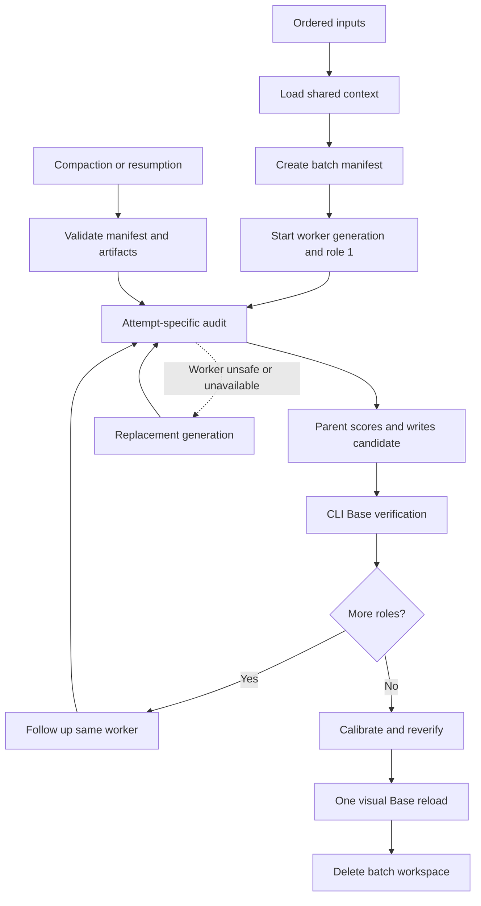

# Batch Workflow Reference

Use this outer workflow only when the user supplies multiple role or application inputs. The single-role workflow in `workflow.md` remains the inner transaction for each candidate.

## 🔄 Pipeline



> [!important] Atomicity
>
> - Exactly one role is current
> - The current role reaches `verified` before the next role begins
> - Do not prefetch or prepare a later role
> - The browser worker owns external inspection only
> - The parent owns evidence mapping, judgment, candidate writes and Base verification

## 1. Start the batch

1. Preserve the user's supplied order. Do not pre-scan or reorder the inputs.
2. Locate the live Application Triage root through the current Job Search index.
3. Scan every `Batch Runs/*/manifest.yaml` before creating anything.
   - one matching incomplete run
     - resume it
   - multiple incomplete runs or a conflicting run
     - ask Flo which run to use
   - `phase: cleanup_pending`
     - recheck cleanup conditions, then delete or report the run
   - orphaned non-empty run directory without a manifest
     - stop and report it
4. Load the complete shared decision context through `workflow.md`.
5. Create `Batch Runs/<YYYYMMDD-HHmmss>/` beside `Candidates/`, never inside it.
6. Make `manifest.yaml` the first file in the run directory.
   - set `phase: initializing`
   - preserve a sanitized form of every ordered input
   - record the complete shared context-source ledger
   - initialize an empty batch-level browser-worker ledger
7. Create one role folder per input under `roles/<index>-<slug>/`.
8. Preserve each sanitized input in `input.md` so recovery never depends on chat history.
9. Confirm every `input_ref`, then set `phase: onboarding` and `current_index: 1`.

The batch workspace is temporary operational state, not a permanent personal profile. The live Base must continue to select only candidate records.

### Manifest shape

```yaml
schema_version: 2
run_id: "20260714-153000"
created_at: "2026-07-14T15:30:00+01:00"
updated_at: "2026-07-14T15:35:00+01:00"
application_triage_root: "path/to/Application Triage"
phase: "onboarding"
current_index: 1
context:
  loaded_at: "2026-07-14T15:30:00+01:00"
  sources:
    - path: "path/to/source"
      purpose: "current positioning"
browser_worker:
  current_generation: 1
  current_transaction: "20260714-153000:01:01"
  generations:
    - generation: 1
      task_name: "job_audit_20260714_153000_g1"
      worker_id: "runtime-worker-id"
      status: "active"
      started_at: "2026-07-14T15:31:00+01:00"
      retired_at:
      reason:
roles:
  - index: 1
    slug: "company-role"
    input_kind: "url"
    safe_input: "https://example.com/job"
    input_ref: "roles/01-company-role/input.md"
    stage: "auditing"
    candidate_path:
    audit:
      current_attempt: 1
      accepted_artifact:
      attempts:
        - attempt: 1
          transaction_id: "20260714-153000:01:01"
          worker_generation: 1
          status: "in_flight"
          artifact: "roles/01-company-role/browser-audit.attempt-1.md"
          started_at: "2026-07-14T15:31:00+01:00"
          finished_at:
    verification:
      checked_at:
      lane:
      status:
      membership:
calibration:
  status: "pending"
  changes: []
```

> [!warning] Persist safe URLs only
>
> - Strip URL credentials, fragments and tracking parameters
> - Redact query values carrying tokens, sessions, invitations, signatures, authentication, keys or authorization codes
> - If redaction breaks access, preserve the public URL or page descriptor and mark `requires_live_session: true`
> - Never persist the sensitive value in the manifest, `input.md` or audit packet

Record every source used to build the shared decision context. Store paths and purposes, not a second canonical profile.

### Durable states

| Role stage | Required proof |
|---|---|
| `pending` | Preserved `input.md` |
| `auditing` | Recoverable current attempt or its attempt-specific artifact |
| `audited` | Valid `accepted_artifact` recorded in the manifest |
| `written` | Recorded candidate path with valid Markdown and frontmatter |
| `verified` | Recorded successful live Base query with observed lane, status and membership |

Worker-generation statuses:

- `launching`
  - deterministic task name is durable, but the runtime worker ID may not be recorded yet
- `ready`
  - idle or completed in the runtime and safely addressable by a follow-up
- `active`
  - processing `browser_worker.current_transaction`
- `unavailable`
  - lost, disconnected, unsupported or unsafe to reuse
- `retired`
  - no further batch transactions may be sent

Attempt statuses:

- `in_flight`
- `accepted`
- `rejected`
- `abandoned`

Write the manifest after every successful role-stage transition. A stage advances only when its required proof exists.

> [!important] Keep `launching`
>
> - It protects the spawn-before-ID crash window
> - It belongs to the batch worker, not the role lifecycle

The batch-level `phase` is one of:

- `initializing`
- `onboarding`
- `calibrating`
- `reverifying`
- `cleanup_pending`

## 2. Run the persistent browser worker

### Start generation 1 with role 1

1. Increment the current role's `audit.current_attempt`.
2. Derive:
   - transaction ID
     - `<run-id>:<two-digit-role-index>:<two-digit-attempt>`
   - worker task name
     - `job_audit_<normalized-run-id>_g<generation>`
   - artifact path
     - `browser-audit.attempt-<n>.md`
3. In one manifest write:
   - set the role to `auditing`
   - append the `in_flight` attempt
   - create worker generation 1 as `launching`
   - set `browser_worker.current_transaction`
4. Prepare one intent-driven fresh-context prompt containing only:
   - the current transaction ID, attempt and worker generation
   - the current role's `input.md`
   - the attempt-specific output path
   - the `browser-audit-worker.md` contract path
   - the required Browser and Chrome skill names
   - the requirement to write the packet before returning
5. Spawn the isolated worker with the first role included in that task.
   - Codex
     - use `fork_turns="none"` explicitly
   - other runtimes
     - use the equivalent fresh-context mechanism
6. Persist the returned worker ID immediately and set its generation to `active`.

The worker reads its browser instructions and initializes its browser binding once during this first transaction.

### Follow up for later roles

After the previous candidate reaches `verified`:

1. Increment the new current role's attempt and derive its transaction ID and artifact path.
2. In one manifest write:
   - set the role to `auditing`
   - append the `in_flight` attempt referencing the current worker generation
   - set the worker generation to `active`
   - set `browser_worker.current_transaction`
3. Send a follow-up to the recorded worker containing only the new transaction inputs.
4. Do not resend browser instructions. The worker reuses its browser binding and obtains a fresh role-local tab binding.

When the runtime cannot safely address a completed worker, mark the generation `unavailable` and use a fresh isolated generation for the current role. This is a portability fallback, not a reason to inspect multiple roles concurrently.

### Replace a generation

Use a replacement only after checking the current attempt's artifact and runtime state:

1. Mark the old generation `unavailable` and record the reason.
2. Mark any unresolved attempt owned by that generation `abandoned` with its finish time.
3. Increment both the worker generation and the current role's attempt.
4. Derive a new transaction ID, task name and attempt-specific artifact path.
5. Persist the new `launching` generation and `in_flight` attempt before spawning.
6. Spawn a fresh-context worker with only the same current role transaction.

Never reuse an abandoned attempt number or artifact path.

### Safe parent overlap

While the current audit runs, the parent may perform read-only preparation for that role:

- duplicate search
- existing company-note lookup
- relevant CV and reviewed-evidence lookup
- nearby live-queue comparison

Do not finalize fit scores, priority, application lane or candidate content until the audit packet is accepted. Do not inspect or prepare the next role.

### Accept the audit

Wait for the current worker transaction to finish, then validate its attempt-specific file:

- YAML frontmatter parses
- transaction ID, attempt, worker generation and `input_ref` match the manifest
- `audit_status` is declared
- company and title are exact
- persisted URLs are sanitized
- role facts, application flow, blockers and unknowns are complete enough for the declared status
- bespoke questions and instructions are verbatim
- the packet contains no personal context, fit judgment or candidate content

If valid, use one manifest write to:

- mark the attempt `accepted`
- record its finish time
- record its immutable path as `accepted_artifact`
- set the role to `audited`
- clear `browser_worker.current_transaction`
- set the worker generation to:
  - `ready` when it remains safely follow-up addressable
  - `unavailable` when the packet survived but the worker did not

Do not copy, rename, edit or promote the accepted attempt file. Every retry receives a new attempt number and output path.

A packet with verified official facts and an explicitly partial or unverified form audit may still be accepted when its blocker and last verified boundary are precise. Do not rerun indefinitely solely because the form is inaccessible.

## 3. Decide, write and verify

The parent resumes sole ownership after the audit packet is accepted.

1. Re-read the current role's `input.md` and recorded `accepted_artifact`.
2. Map the role against the loaded CV and vault evidence.
3. Assign Candidate Fit, Goal Fit, role family, application work, status and relative priority.
4. Follow `workflow.md` to detect duplicates and create or safely update the candidate directly.
5. Keep the managed decision block concise and non-repetitive while preserving exact questions and evidence boundaries.
6. Store `candidate_path` and set the role to `written` only after its Markdown and frontmatter parse.

The candidate note is the durable decision record. Do not write a second judgment checkpoint.

### CLI-first Base verification

For each written candidate:

1. Query the live Base through the Obsidian CLI.
   - use `base:query` against the live Base definition
   - prefer one query whose result proves the candidate, derived lane, status and relevant active or inactive membership
   - query an additional view only when the first result cannot prove a required transition
2. Compare the returned candidate path and values with the written record.
3. If the result is absent, stale or contradictory:
   - run `obsidian reload`
   - repeat the same query
   - keep the role at `written` and stop if the contradiction remains
4. Record the verification timestamp and observed lane, status and membership.
5. In the same manifest write that sets the role to `verified`:
   - another role exists
     - advance `current_index`
   - final role
     - set `current_index: null`
     - set `phase: calibrating`
     - retire the ready worker generation and clear any current transaction

Do not visually open or reload the Base for every candidate.

## 4. Recover after compaction or interruption

Treat any of these as a recovery trigger:

- prior conversation turns were replaced by a summary
- a fresh parent resumes an existing manifest
- the parent cannot confirm every context source is active
- remembered state disagrees with the manifest
- the worker completes between roles
- the worker or browser connection becomes unavailable

Before spawning, scoring or writing:

1. Re-read `SKILL.md`, `workflow.md` and this file completely.
2. Identify the matching incomplete manifest before creating state.
3. Re-read every source in the manifest's shared context ledger.
4. Refresh the current Job Search entry points, candidate template, triage guide, Base and live candidate queue.
5. Re-read the current role's `input.md` and every artifact required by its recorded stage.
6. Validate durable proof and move the manifest downward when proof is absent.
7. Resume from the first incomplete stage.

### Recover the worker and attempt

Always validate the current attempt's artifact first.

- valid artifact matching the current transaction
  - accept it even if the worker response was missed
- worker generation is `launching` without an ID
  - search the runtime for the exact deterministic task name
  - found
    - attach its ID and rejoin
  - not found
    - mark the generation `unavailable` and the attempt `abandoned`
- recorded worker is active on the current transaction
  - rejoin or wait
- recorded worker is safely follow-up addressable but no valid packet exists
  - mark the failed attempt `rejected` or `abandoned`
  - start a new attempt without reusing its artifact path
- worker is missing, disconnected, ambiguous or unsupported
  - mark its generation `unavailable`
  - abandon the current attempt
  - start a replacement generation for the same role

An abandoned or rejected attempt can never become accepted later. A stale worker may write only its own attempt-specific path; a late attempt 1 therefore cannot replace an accepted attempt 2.

### Recover the candidate

- stage is `audited`
  - validate the accepted audit
  - recompute the parent judgment from the reloaded shared context
  - run duplicate detection again
  - perform the managed-block write idempotently
  - validate, record the path and advance to `written`
- candidate write succeeded before the manifest update
  - the role still appears `audited`
  - rerun the same idempotent write and validation
- stage is `written`
  - trust only the recorded `candidate_path`
  - validate its Markdown and frontmatter
  - missing or invalid proof moves the role back to `audited`
  - valid proof resumes at Base verification
- candidate merely exists
  - this proves nothing because an exact duplicate may have predated the batch
- stage is `verified`
  - require the recorded Base verification result
  - absent proof moves the role back to `written`

Never rely on conversational context to recover information removed by compaction. Never begin the next role to keep the batch moving.

## 5. Calibrate, visually verify and clean up

After every role is `verified`:

1. Confirm `phase: calibrating` and `current_index: null`.
2. Compare the completed batch candidates together and against the live queue.
3. Write the complete proposed-change ledger before applying it.
   - candidate path
   - old and proposed `triage_priority`
   - old and exact proposed ranking rationale
   - apply status
   - verification status
4. Set `calibration.status: planned` after the complete ledger is durable.
5. Recalibrate only `triage_priority` and the relative-ranking rationale inside each managed block.
6. Mark each ledger entry applied immediately after its candidate write succeeds.
7. Replay pending entries idempotently after recovery.
   - candidate matches the proposal
     - mark applied
   - candidate matches the recorded old state
     - apply the proposal
   - candidate matches neither
     - stop and report a conflict
8. Do not change fit scores, application facts, status or unrelated candidate content during calibration.
9. Set `phase: reverifying`, then verify each changed candidate through the CLI-first path.
10. After all CLI checks pass, open the Base and force one live visual reload.
11. Confirm the final batch ordering, derived lanes, statuses and active or inactive membership.
12. Set `calibration.status: verified`, then `phase: cleanup_pending`.
13. Delete the batch workspace only when:
    - every role is `verified`
    - every calibration change is applied and verified
    - the final visual check passes
    - no worker transaction remains active
    - no blocker prevents cleanup
14. Application actions preserved in a verified candidate, including account gates, do not block cleanup.
15. Report the final ordering and confirm checkpoint cleanup.

## 6. Failure boundaries

| Failure | Result |
|---|---|
| Missing or invalid browser evidence | Stay at `auditing` |
| Worker identity or current transaction is ambiguous | Replace the worker and retry the current role |
| Failed candidate validation | Stay at `audited` |
| Failed Base verification | Stay at `written` |
| Duplicate ambiguity | Pause on the current role until Flo chooses the record |
| Account-gated or partly hidden form | Verify only when the packet preserves the exact blocker and unknowns |

> [!warning] Never skip forward
>
> - Do not audit multiple roles concurrently
> - Do not prefetch or prepare the next role
> - Do not delete the workspace while any role is incomplete
> - Do not delete the workspace while any calibration change is unverified

## ⚡ Performance shape

- First role includes isolated-worker and browser setup.
- Later roles reuse the worker, browser instructions, browser documentation and browser binding.
- Every role avoids audit copying, duplicate judgment prose and routine visual reloads.
- Design toward roughly 2.5 to 4 minutes per later role without treating that range as a guarantee or weakening evidence quality.
