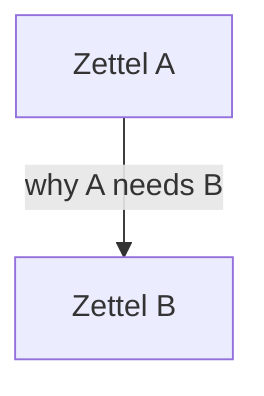

# Network-First Zettel Clusters

Use this mode when Flo has a bundle of distinct but connected claims. The map is thinking scaffolding: it establishes what each Zettel says and why it points to the next one before prose makes the boundaries harder to see.

## 1. Mirror the Claims

- Extract every proposed Zettel from Flo's braindump.
- Keep his titles when he has them; alternatives remain suggestions.
- Separate atomic claims from examples, evidence, and transitions.
- Mark undeveloped branches as placeholders. Do not fill them or pressure Flo to develop them.
- Play the set back before treating the structure as settled.

Do not improve the argument with outside knowledge. At this stage, completeness means faithfully representing Flo's network, not producing the strongest possible essay.

## 2. Draw the Network

Use a Mermaid flowchart when the diagram makes the connected claims easier to grasp.

- **Node**
  - One proposed Zettel and one atomic claim.
- **Directed edge**
  - The sentence-level reason the source note should link to the destination.
  - Write it as a transition that could naturally appear in the source Zettel.
- **Direction**
  - Choose `TB` or `LR` based on readability, especially on mobile.
- **Groups**
  - Use only when they clarify conceptual stages or competing paths.
  - Keep fills transparent and styling restrained.

The arrow label is essential. A graph that only says which notes connect does not expose how the eventual prose moves between them.

Show the diagram in chat by default. Create a temporary file under `__Sandbox__/` only when Flo asks for a file or explicitly wants the map saved in the vault.

## 3. Play Back Each Node

For each proposed Zettel, give only what helps Flo verify the architecture:

- Working title.
- Role in the network.
- Ideas Flo supplied for that note.
- Incoming and outgoing transitions when they clarify the note's job.

Do not impose this as the eventual Zettel template. It is a map of the material, not a body draft.

## 4. Hand Off to Drafting

Flo may create empty stubs before requesting prose. For a large batch, a committed set of stubs is a useful rollback checkpoint, but it is optional and must not become ceremony for ordinary notes.

Authorization remains precise:

| Flo asks for | Allowed output |
|---|---|
| Ideation, map, outline, or connections | Mirror and scaffolding in chat |
| A draft in chat | Zettel prose in chat only |
| Write or update named notes | Direct edits to those notes or named regions |

Initial drafting may cover the connected bundle when Flo explicitly requests it. Preserve frontmatter and keep `#wip` until Flo removes it or asks.

## 5. Calibrate Through Review

Flo may review one note at a time while the others remain provisional.

Before every edit:

1. Re-read the live note.
2. Identify exactly what Flo approved, deleted, and asked to change.
3. Patch only that region or the remaining notes in scope.

Use Flo's reviewed notes and committed edits as the strongest evidence of voice for the remaining `#wip` notes. Do not rewrite finished notes to enforce uniformity.

### Style means movement, not mimicry

- Start from the practical question or concrete example when that is how Flo framed the idea.
- Make the contradiction, qualification, or reversal easy to see.
- Let wikilinks carry the reasoning into the next claim instead of collecting detached related links.
- Use `~`, `?`, `^`, `=`, and `=>` only when they genuinely expose the thought process.
- Do not manufacture casualness by repeatedly inserting conspicuous phrases such as “Okay,” “Boom,” or “Aaaand.” A phrase that works once is not a reusable style token.
- Let the structure follow the idea. Do not make every note look the same.

## Hard Boundaries

- Flo's deletion is evidence that the idea or wording does not belong. Do not re-add it as a paraphrase.
- Flo's approved opening, ending, or section is immutable unless he later puts it back in scope.
- A horizontal rule may mark an explicit editing boundary. Preserve the approved side verbatim.
- Technically correct padding is still foreign material. Do not add examples, caveats, conclusions, or lessons Flo did not provide.
- When a transition is missing, expose the gap or ask an open question. Never bridge it with an invented insight.
